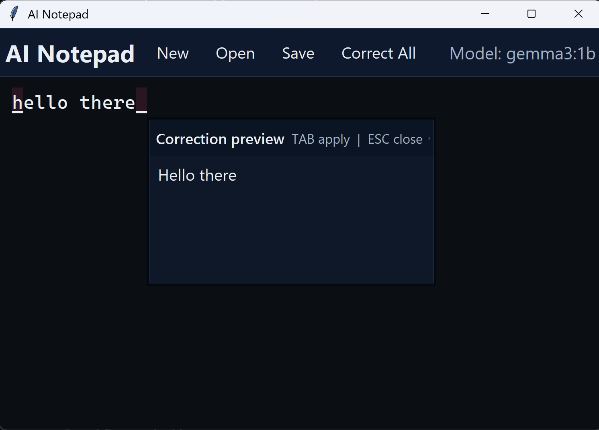

# AI Notepad

Local Tk desktop notepad with spelling and grammar help via Ollama. The GUI runs natively on Windows.
Docker is used for the Ollama model server and the shared SQLite vocabulary in `./data/`.




## Prerequisites

- Docker Desktop
- Python 3 + pip on host (dependencies install into `.venv`)

## Run on Windows (native GUI)

```powershell
powershell -ExecutionPolicy Bypass -File .\run.ps1
```

If you want to run `.\run.ps1` directly without `-ExecutionPolicy Bypass`, allow scripts once for your user:

```powershell
Set-ExecutionPolicy -Scope CurrentUser RemoteSigned
```

To remove that permission later (restore the default for your user):

```powershell
Set-ExecutionPolicy -Scope CurrentUser Undefined
```

## Run on Linux (native GUI)

```bash
chmod +x ./run.sh
./run.sh
```

## Cleanup

### Windows

```powershell
.\cleanup.ps1
```

### Linux

```bash
chmod +x ./cleanup.sh
./cleanup.sh
```
